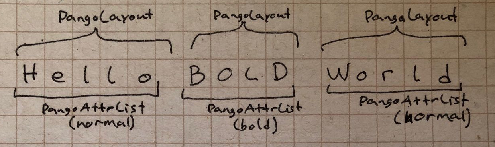
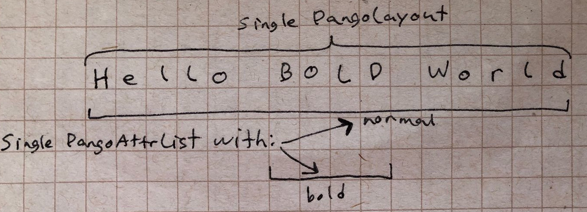
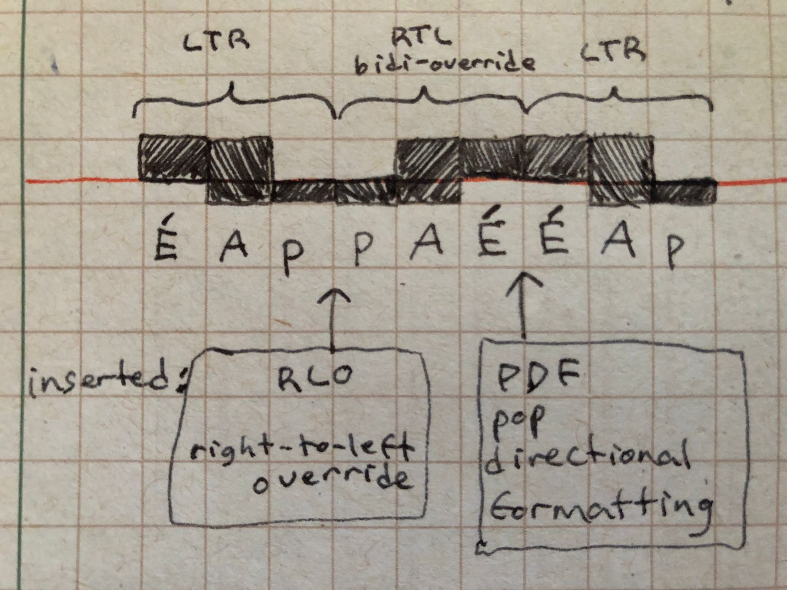
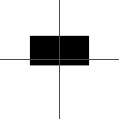
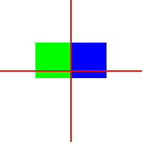
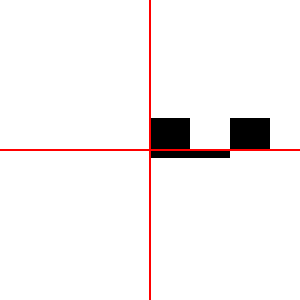
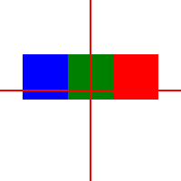

Text layout
===========

This document describes the state of text layout in librsvg as of
version 2.55.90, and how I want to overhaul it completely for SVG2.

Status as of librsvg 2.55.90
----------------------------

Basic supported features:

-  Librsvg supports the elements ``text``, ``tspan``, ``a`` inside text,
   and ``tref`` (deprecated in SVG2, but kept around for SVG1.1
   compatibility). See below for the ``x/y/dx/dy`` attributes; librsvg
   supports single-number values in these.

-  ``text-anchor``.

-  SVG1.1 values for ``direction``, ``writing-mode``. Non-LTR or
   vertical text layout is very much untested.

-  SVG1.1 values for ``letter-spacing``, ``baseline-shift``,
   ``text-decoration``.

-  ``font`` (shorthand), ``font-family``, ``font-size``,
   ``font-stretch``, ``font-style``, ``font-variant``, ``font-weight``.

-  ``text-rendering``.

- ``unicode-bidi`` and ``direction``.  This is done for each text
   span, but not for the whole ``<text>`` element yet.  See below for
   details.

Major missing features:

-  ``text-orientation`` and ``glyph-orientation-vertical`` fallbacks,
   SVG2 values for ``writing-mode``.

-  SVG2 ``white-space`` handling. This deprecates ``xml:space`` from
   SVG1.1.

-  Support for multiple values in each of the attributes ``x/y/dx/dy``
   from the ``text`` and ``tspan`` elements. Librsvg supports a single
   value for each attribute, whereas SVG allows for multiple values —
   these then get used to individually position “typographic characters”
   (Pango clusters). In effect, librsvg’s single values for each of
   those attributes mean that each text span can be positioned
   independently, but not each character.

-  Relatedly, the ``rotate`` attribute is not supported. In SVG it also
   allows multiple values, one for each character.

-  ``glyph-orientation-vertical`` (note that
   ``glyph-orientation-horizontal`` is deprecated in SVG2).

-  ``textPath`` is not supported at all. This will be made much easier
   by implementing ``x/y/dx/dy/rotation`` first, since each character
   needs to be positioned and oriented individually.

-  ``@font-face`` and WOFF fonts.

- Emoji got inadvertently broken; see the "Emoji" section below.

Other missing features:

-  ``display`` and ``visibility`` are not very well tested for the
   sub-elements of ``<text>``.

-  SVG2 text with a content area / multi-line / wrapped text:
   ``inline-size``, ``shape-inside``, ``shape-subtract``,
   ``shape-image-threshold``, ``shape-margin``, ``shape-padding``. This
   is lower priority than the features above. Also the related
   properties ``text-overflow``,

-  ``text-align`` (shorthand), ``text-align-all``, ``text-align-last``,
   ``text-indent``, ``word-spacing``.

-  Baselines: ``vertical-align`` (shorthand), ``dominant-baseline``,
   ``alignment-baseline``, ``baseline-source``, and SVG2 values for
   ``baseline-shift``. Note that Pango doesn’t provide baseline
   information yet.

-  ``line-height`` (parsed, but not processed).

-  SVG2 ``text-decoration``, which translates to
   ``text-decoration-line``, ``text-decoration-style``,
   ``text-decoration-color``.

-  ``font-feature-settings``, ``font-kerning``, ``font-size-adjust``.

-  CSS Text 3/4 features not mentioned here.

Features that will not be implemented:

-  SVG1.1 features like ```` and the
   ``glyph-orientation-horizontal`` property, that were deprecated for
   SVG2.

Roadmap summary
---------------

Since librsvg 2.52.1 I’ve started to systematically improve text
support. Many thanks to Behdad Esfahbod, Khaled Ghetas, Matthias Clasen
for their advice and inspiration.

First, I want to get **bidi** to a state where it is reliable, at least
as much as LTR languages with Latin text are reliable right now:

-  Add tests for the different combinations of ``text-anchor`` and
   ``direction``; right now there are only a few tested combinations.

-  Test and implement multiply-nested changes of direction. I think only
   a single level works right now.

-  Even if white-space handling remains semi-broken, I think it’s more
   important to have “mostly working” bidi than completely accurate
   white-space handling and layout.

Second, actually overhaul librsvg’s text engine by implementing the SVG2
text layout algorithm:

-  Implement the ``text-orientation`` property, and implement fallbacks
   from the deprecated ``glyph-orientation-vertical`` to it. If this
   turns out to be hard with the current state of the code, I will defer
   it until the SVG2 text layout algorithm below.

-  Implement the SVG2 text layout algorithm and ``white-space`` handling
   at the same time. See the detailed roadmap below.

Third, implement all the properties that are not critical for the text
layout algorithm, and things like ``@font-face``. Those can be done
gradually, but I feel the text layout algorithm has to be done all in a
single step.

Architecture notes
------------------

A common theme over the next subsections is, "we need a single
``pango::Layout`` per ``<text>`` element".  Keep that in mind as the
main goal of initial refactoring.

Chunks and spans
~~~~~~~~~~~~~~~~

Librsvg implements a limited subset the `text layout as per SVG1.1
<https://www.w3.org/TR/SVG11/text.html>`_, which was feasible to
implement in terms of *chunks* and *spans*.

A *span* is an ``<tspan>`` element, or some character content inside ``<text>``.

When a ``tspan`` explicitly lists ``x`` or ``y`` attributes, it
creates a new *chunk*.  A text chunk defines an absolutely-positioned
sequence of spans.

This is why you'll see that the code does this; start at
:internals:struct-method:`rsvg::text::Text::draw`:

- Start with an empty list of chunks
  (:internals:struct-method:`rsvg::text::Text::make_chunks`).
  Push an empty initial chunk defined by the ``x`` and ``y``
  coordinates of the ``<text>`` element.

- Recursively call :internals:fn:`rsvg::text::children_to_chunks`
  on the children of the ``<text>`` element, to create chunks and
  spans for them.

- :internals:struct-method:`rsvg::text::TSpan::to_chunks`
  sees if the span has ``x`` or ``y`` attributes; if so, it pushes a
  new empty chunk with those coordinates.  Then it recursively calls
  ``children_to_chunks`` to grab its character content and children.

- Later, ``Text::draw`` takes the list of chunks and their spans, and
  converts them into a list of :internals:struct:`rsvg::text::MeasuredChunk`.
  This process turns each span into a
  :internals:struct:`rsvg::text::MeasuredSpan`.  The key element here is to
  create a ``pango::Layout`` for each span, and ask it for its size.

- Then, ``Text::draw`` takes the list of ``MeasuredChunk`` and turns them
  into a list of :internals:struct:`rsvg::text::PositionedChunk`.  Each of
  those builds a list of :internals:struct:`rsvg::text::PositionedSpan` based
  on the span's own text advance, plus the span's ``dx``/``dy`` attributes.

**Note about SVG2:** The `text layout algorithm for SVG2
<https://www.w3.org/TR/SVG2/text.html#TextLayoutAlgorithm>`_ is very
different from the above.  It mostly dispenses with explicit
computation of chunks with spans, and instead, for each glyph it
stores a flag that says whether the glyph is at the beginning of a
chunk.

Layouts and spans
~~~~~~~~~~~~~~~~~

Librsvg creates a ``pango::Layout`` for each
text span in a ``<text>`` element, whether it comes from a ``<tspan>``
or not.  For example, ``<text>A <tspan>B</tspan> C</text>`` has three
spans, and three Pango layouts created for it.  Each span's
``pango::Layout`` gets configured via ``pango::AttrList`` with the
styles it needs (bold/italic, font size, etc.).

When a ``pango::AttrList`` gets created, each individual attribute has
a start/end index based on the byte offsets for the corresponding
characters.  Currently, **all the attributes for a span occupy the whole text span**.  So, for something like

.. code-block:: xml

  <text>
    Hello
    <tspan font-weight="bold">
      BOLD
    </tspan>
    World
  </text>

three ``pango::Layout`` objects get created, with ``Hello``, ``BOLD``,
and ``World``, and the second one has a ``pango::AttrList`` that spans
its entire 4 bytes.  (There's probably some whitespace in the span,
and the attribute list would include it — I'm saying "4" since it is
easy to visualize for example purposes.)  So, currently there are
three ``PangoLayout`` and each with a ``PangoAttrList``:

However, this is sub-optimal.  Ideally there should be a *single*
``pango::Layout`` for a single string, ``Hello BOLD World``, and the
attribute list should have a boldface attribute just for the word in
the middle.

Why?  Two reasons: shaping needs to happen across spans (it doesn't
right now), and the handling for ``unicode-bidi`` and ``direction``
need to be able to work across nested spans (they work with a single
level of nesting right now).  Read the "Bidi handling" section below
for more info.

The ``add_pango_attributes`` function is already able to handle
substrings of a ``pango::Layout``; it's just that it is always called
with the whole layout right now.

**The initial refactoring:** Change the text handling code to first
gather all the character content inside a ``<text>`` into a single
string, while keeping track of the offsets of each span.  Make the
``pango::AttrList`` taking those offsets into account.  Then, feed
that single string to a ``pango::Layout``, with the attributes.

**Further work:** Don't just paint the layout, but iterate it / break
it up into individual ``pango::GlyphString``, so librsvg can lay out
each individual glyph itself using the SVG2 layout algorithm.

Be careful with PDF output when handling individual glyphs: grep for
``can_use_text_as_path`` in ``drawing_ctx.rs``.

Bidi handling
~~~~~~~~~~~~~

The ``unicode-bidi`` and ``direction`` properties get handled
together.  The :internals:struct:`rsvg::text::BidiControl`
struct computes which Unicode control characters need to be inserted
at the start and end of a ``<tspan>``'s text; SVG authors use these
properties to override text direction when inserting LTR or RTL text
within each other.

Unfortunately, these control characters can only really work for
nested levels of embedding **if the whole text is in a single
``pango::Layout``**.  Per the previous section, librsvg doesn't do
this yet.

:pr:`621` implemented the SVG2 values for the ``unicode-bidi`` property.
You may want to read the detailed commit messages there, and the
discussion in the merge request, to see details of future development.

Detailed roadmap
----------------

Add tests for combinations of ``text-anchor`` and ``direction``
~~~~~~~~~~~~~~~~~~~~~~~~~~~~~~~~~~~~~~~~~~~~~~~~~~~~~~~~~~~~~~~

These are easy to add now that librsvg’s tests make use of the Ahem
font, in which each glyph is a 1x1 em square.

Implement the ``text-orientation`` property
~~~~~~~~~~~~~~~~~~~~~~~~~~~~~~~~~~~~~~~~~~~

This may just be the property parser and hooking it up to the machinery
for properties. Actual processing may be easier to do in the SVG2 text
layout algorithm, detailed below.

Implement the SVG2 text layout algorithm and ``white-space`` handling.
~~~~~~~~~~~~~~~~~~~~~~~~~~~~~~~~~~~~~~~~~~~~~~~~~~~~~~~~~~~~~~~~~~~~~~

**Shaping:** One thing librsvg does wrong is that for each ``<tspan>``,
or for each synthesized text span from a ``<text>`` element, it creates
a separate ``pango::Layout``. This means that text shaping is not done
across element boundaries (SVG2 requirement). Implementing this can be
done by creating a string by recursively concatenating the character
content of each ``<text>`` element and its children, and adding
``pango::Attribute``\ s with the proper indexes based on each child’s
character length. This creates an un-shaped string in logical order with
all the characters inside the ``<text>``, to be used in the next steps.

Pango details: create a single ``pango::Layout``, per ``<text>``
element, with ``pango::Attribute`` for each text span. Set the layout to
``set_single_paragraph_mode()`` so it does not break newlines. Pango
will then translate them to characters in the ``Layout``, and the
white-space handling and SVG2 text layout algorithm below can detect
them.

**White-space handling:** SVG2 has a new ``white-space`` property that
obsoletes ``xml:space`` from SVG1.1. Implementing this depends on the
concatenated string from the steps above, so that white-space can be
collapsed on the result. Maybe this needs to be done before inserting
bidi control characters, or maybe not, if the state machine is adjusted
to ignore the control characters.

**SVG2 text layout algorithm:** This is the big one. The spec has
pseudocode. It depends on the shaping results from Pango, and involves
correlating “typographic characters” (Pango clusters) with the
un-shaped string in logical order from the “Shaping”, and the
information about `discarded white-space characters
<https://www.w3.org/TR/css-text-3/#white-space-processing>`_. The
complete text layout algorithm would take care of supporting
multi-valued ``x/y/dx/dy/rotate``, ``textPath`` (see below), plus bidi
and vertical text.

Do look at the issues in the `svgwg repository at GitHub
<https://github.com/w3c/svgwg/tree/master>`_ - there are a couple that
mention bugs in the spec's pseudocode for the text layout algorithm.

Bidi embedding
~~~~~~~~~~~~~~

When there are nested left-to-right (LTR) and right-to-left (RTL) languages in a text element, this must happen:

1. Extract the text content from the spans, but...

2. Insert Unicode control characters at each embedding level (at each span boundary)...

3. So that Pango/Harfbuzz/etc. will know when text direction must change.

For example, consider this SVG from
:source:`rsvg/tests/fixtures/text/unicode-bidi-override.svg`:

.. code:: xml

   <?xml version="1.0" encoding="utf-8"?>
   <svg xmlns="http://www.w3.org/2000/svg" width="600" height="600">
     <rect x="0" y="0" width="100%" height="100%" fill="white"/>
   
     <text x="100" y="100" font-family="Ahem" font-size="20">ÉAp<tspan direction="rtl" unicode-bidi="bidi-override">ÉAp</tspan>ÉAp</text>
   </svg>

It gets rendered like this (see the description of the Ahem font below to make sense of this):

Let's break it up part by part:

* The ``<text>`` element starts by default in left-to-right (LTR) direction.

* The first ``ÉAp`` gets laid out trivially, from left to right.

* The second ``ÉAp`` is in a ``tspan`` with ``direction="rtl"`` and ``unicode-bidi="bidi-override"``.  It gets laid out right-to-left, and looks like ``pAÉ``, but for the platform libraries to know this, it needs to be surrounded with Unicode control characters "Right to Left Override (RLO)" and "Pop Directional Formatting (PDF)".  This is done in `from_unicode_bidi_and_direction() <https://gitlab.gnome.org/GNOME/librsvg/-/blob/5d43d27adec414515669a817e015832c85ec7232/rsvg/src/text.rs?page=2#L1177-1198>`_ and `wrap_with_direction_control_chars() <https://gitlab.gnome.org/GNOME/librsvg/-/blob/5d43d27adec414515669a817e015832c85ec7232/rsvg/src/text.rs?page=2#L1200-1216>`_.

* The third ``ÉAp`` gets laid out again from left-to-right.

Text rendering
~~~~~~~~~~~~~~

Librsvg is moving towards a “render tree” or “display list” model,
instead of just rendering everything directly while traversing the DOM
tree.

Currently, the text layout process generates a ``layout::Text`` object,
which is basically an array of ``pango::Layout`` with extra information.

It should be possible to explode these into ``pango::GlyphItem`` or
``pango::GlyphString`` and annotate these with ``x/y/rotate``
information, which will be the actual results of the SVG2 text layout
algorithm.

Although currently Pango deals with underlining, it may be necessary to
do that in librsvg instead - I am not sure yet how ``textPath`` or
individually-positioned ``x/y/dx/dy/rotate`` interact with underlining.  See also 

Pango internals
~~~~~~~~~~~~~~~

::

   /**
    * pango_renderer_draw_glyph_item:
    * @renderer: a `PangoRenderer`
    * @text: (nullable): the UTF-8 text that @glyph_item refers to
    * @glyph_item: a `PangoGlyphItem`
    * @x: X position of left edge of baseline, in user space coordinates
    *   in Pango units
    * @y: Y position of left edge of baseline, in user space coordinates
    *   in Pango units
    *
    * Draws the glyphs in @glyph_item with the specified `PangoRenderer`,
    * embedding the text associated with the glyphs in the output if the
    * output format supports it.
    *
    * This is useful for rendering text in PDF.
    * ...
    */

Note that embedding text in PDF to make it selectable involves passing a
non-null ``text`` to pango_renderer_draw_glyph_item(). We’ll have to
implement this by hand, probably.

Wrapped text in a content area
~~~~~~~~~~~~~~~~~~~~~~~~~~~~~~

This roadmap does not consider the implementation fo wrapped text yet.

User-provided fonts, ``@font-face`` and WOFF
~~~~~~~~~~~~~~~~~~~~~~~~~~~~~~~~~~~~~~~~~~~~

This involves changes to the CSS machinery, to parse the ``@font-face``
at-rule. Librsvg would also have to obtain the font and feed it to
FontConfig. I am not sure if FontConfig can deal with WOFF just like
with normal ``.ttf`` files.

See the issue on the :issue:`Future of the pango dependency <876>`
for lots of goodies which may come in handy.

Emoji is broken
~~~~~~~~~~~~~~~

:issue:`599` is a terrible bug in Pango, which causes it to report
incorrect metrics when text is scaled non-proportionally (e.g. different
scale factors for the X/Y dimensions).  Librsvg works around this by
converting all text to Bézier paths, then scaling the paths, and then
stroking/filling them.

However, this breaks emoji - :issue:`911`, since converting its glyphs
to paths loses the color information.

Two strategies to fix this; there may be more:

- Detect if the text is scaled proportionally (this is the common
  case), and use the old code for that, without converting text to
  paths.  This may be easy to do?  Grep for ``can_use_text_as_path``
  in ``drawing_ctx.rs`` which already has some of the logic but for
  handling PDF output.

- Do the whole "split a ``pango::Layout`` into glyphs" from above;
  keep handling individual glyphs as paths, and special-case emoji to
  render them via Cairo.

Issues
------

:issue:`795` - Implement SVG2 white-space behavior.

Issues that have not been filed yet
~~~~~~~~~~~~~~~~~~~~~~~~~~~~~~~~~~~

From the spec: “It is possible to apply a gradient, pattern, clipping
path, mask or filter to text.” We need better tests for the
``objectBoundingBox`` of the whole ``<text>``; I think :issue:`they are
wrong for vertical text <55>`, and this shows up when filling its spans
with gradients or patterns.

Clip/mask/filter do not work on individual spans yet.  I am not sure
if their ``objectBoundingBox`` refers to the whole ``<text>`` or just
the span.

Multiply-nested changes of text direction / bidi overrides; see the
"Bidi handling" section above.

Glossary so I don’t have to check the Pango docs every time
-----------------------------------------------------------

PangoItem - A range within the user’s string that has the same
language/script/direction/level/etc. (Logical order).

PangoLayoutRun - same as PangoGlyphItem - a pair of PangoItem and the
PangoGlyphString it generated during shaping. (Visual order).

PangoGlyphString - The glyphs generated for a single PangoItem.

PangoGravityHint - Defines how horizontal scripts should behave in a
vertical context.

Development plan
----------------

There's a few of ways of implementing the SVG2 text algorithm, while
keeping the existing SVG1.1 code working:

* Try to refactor ``rsvg/src/text.rs`` gradually to SVG2.  This is probably
  overkill; the SVG1.1 algorithm there is very much oriented towards
  just thinking of chunks ans spans, and the SVG2 algorithm subsumes
  those.

* Disable all the tests that use text, and write a new implementation.
  Enable the tests gradually as features appear.

* Implement a ``<text2>`` element with all the new code for SVG2.
  Don't disable existing tests; rather, write a test suite based on
  the Ahem font just for ``<text2>`` that lets us build things from
  the ground up.

There is code in ``rsvg/src/text.rs`` that will still be useful: the
conversions between SVG types and Pango types, the tables with Unicode
directional formatting characters, and some of the utility functions
for Pango.

I think the third scheme is the best one to follow for internships:

* We can preserve the current code as it is; it works fine for many purposes.

* We can write a new test suite for text that we *know* is
  comprehensive, instead of relying on the sketchy tests from the
  SVG1.1 test suite.  The Ahem font should make it easy to have
  reftest-style tests and let us implement things in a "constructive"
  fashion from the ground up.

* We can compare the output of ``<text2>`` and ``<text>`` without
  hackery or conditional compilation, to ensure that new new
  implementation produces as reasonable results as the old one.

* Eventually we can remove the old implementation, rename ``text2`` to
  ``text`` everywhere, and just leave the new implementation in place.

Reproducible text rendering for the test suite
----------------------------------------------

Librsvg uses the pango/harfbuzz/freetype/fontconfig stack, so it
assumes that fonts are installed in some system-wide location, and
perhaps the user's own ``~/.fonts``.  However, for the test suite we
would like to have a 100% predictable set of available fonts, and a
reproducible configuration for things which even *have* configuration
like fontconfig.

Briefly:

* Pango - does high-level text layout for GTK and librsvg; uses all
  the following libraries.  You give it a Unicode string, and it will
  do bidi/shaping/layout and render it for you.

* Harfbuzz - Does text shaping.

* Freetype - Renders glyphs.

* Fontconfig - Does "font enumeration", or finding the fonts that are
  installed on the system, and substitues missing fonts; if you ask
  for "Times New Roman" but don't have it installed, fontconfig can
  give you another serif font instead.

Librsvg mostly only uses Pango directly, with one exception.  The code
to set up the test suite calls Fontconfig to set up a minimal, custom
font map.  We want to make the fonts available from
``rsvg/tests/resources/`` *and nothing else* so that we know exactly
what will be used while rendering test files.  There's also a custom
``fonts.conf`` there for Fontconfig, to set up some minimal
substitutions.

Ahem font for tests
-------------------

A big problem when writing tests for a text layout engine is that font
rendering can change in extremely subtle ways depending on the
underlying font-rendering libraries, the available fonts, the
rendering options, etc.  If a few pixels change in the antialiasing
around glyphs, or if glyphs shift around by sub-pixel distances, is
that a failed test or not?

To make it easy to write reproducible tests, there is the `Ahem font
<https://web-platform-tests.org/writing-tests/ahem.html>`_.  It is
useless for human-readable text, but **most glyphs are 100% simple
squares** or simple rectangles that you can compare easily to
reference images.

This is the string ``A`` rendered in the Ahem font, with red lines
that cross at its anchor point and baseline:

.. literalinclude:: assets/ahem-a.svg
   :language: xml

Note the following:

* This is a single glyph ``A`` that renders as a square.

* The square is exactly 50 pixels tall and wide, since we specified
  ``50px`` in the ``font:`` property.

* The ascent is 40 pixels, above the horizontal red line, and the
  descent is 10 pixels below it.

Now let's render two glyphs ``AB``, centered:

.. literalinclude:: assets/ahem-ab.svg
   :language: xml

Now the same as before, but with each glyph in a separate ``tspan`` of a different color:

.. literalinclude:: assets/ahem-ab-color.svg
   :language: xml

What if we need to test some things but actually be able to
differentiate glyphs?  Here, the glyphs for ``A``, ``p`` and ``É`` are
rendered different.  `See the available glyphs
<https://hydrock.github.io/AhemFont/>`_.  In any case, all the glyphs
fit in the em-square and are just rectangles that cover different
parts of that area.

.. literalinclude:: assets/ahem-different-glyphs.svg
   :language: xml

Details on the Ahem font
~~~~~~~~~~~~~~~~~~~~~~~~

* `Ahem font, main page <https://web-platform-tests.org/writing-tests/ahem.html>`_
* `Rendered glyphs for easy reference <https://hydrock.github.io/AhemFont/>`_
* `Source for the previous link, with interesting examples <https://github.com/Hydrock/AhemFont?tab=readme-ov-file>`_
* `Ahem font README with list of glyphs <https://www.w3.org/Style/CSS/Test/Fonts/Ahem/README>`_
* `Fonts for CSS testing <https://www.w3.org/Style/CSS/Test/Fonts/>`_

How librsvg's test suite uses Ahem
~~~~~~~~~~~~~~~~~~~~~~~~~~~~~~~~~~

If you grep for ``Ahem`` in the test files (``rsvg/tests/``), you will
find how it is used to test the layout of various aspects of the
``<text>`` element.

When implementing the SVG2 text layout algorithm, we should have
fine-grained tests for each little feature, to ensure that it produces
the expected layout.  Regretfully, the original SVG1.1 test suite only
has very high level tests for text layout, which don't make it easy to
automatically test if the building blocks of the code are correct.

In the Ahem font, for each glyph 4/5 of the heigth are above the
baseline, and 1/5 of the height is below the baseline.  This means
that to get whole-pixel-exact rendering, your glyphs should have a
size that is a multiple of 5.  In the examples above, we used font
heights of 40px and 50px, which are of course multiples of 5.

Some ideas for the ``<text2>`` tests with Ahem
~~~~~~~~~~~~~~~~~~~~~~~~~~~~~~~~~~~~~~~~~~~~~~

* Testing general layout and ``text-anchor``.

* Testing bounding boxes.

* Use different glyphs and colors to test bidi embedding.  For
  example, here ``RGB`` renders as ``BGR`` due to ``direction="rtl"``:

.. literalinclude:: assets/ahem-rtl.svg
   :language: xml
